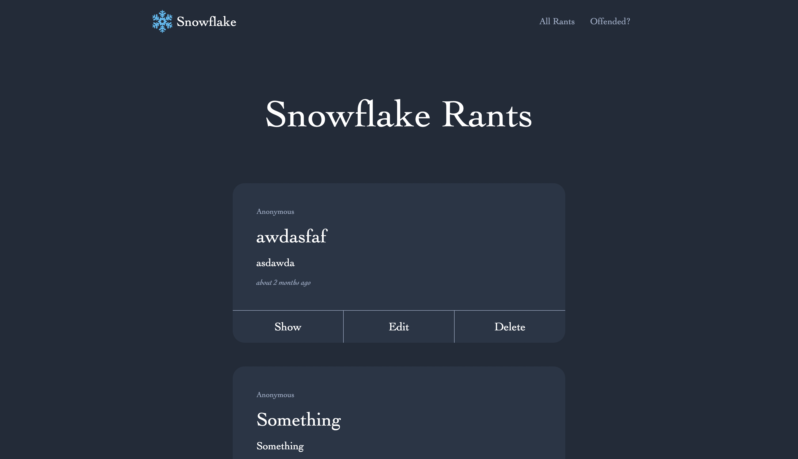
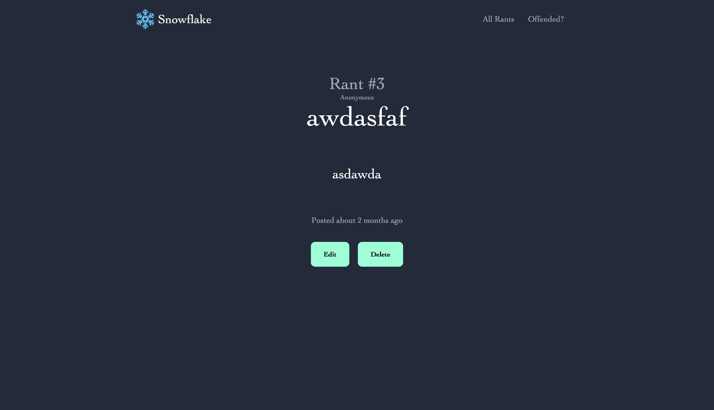
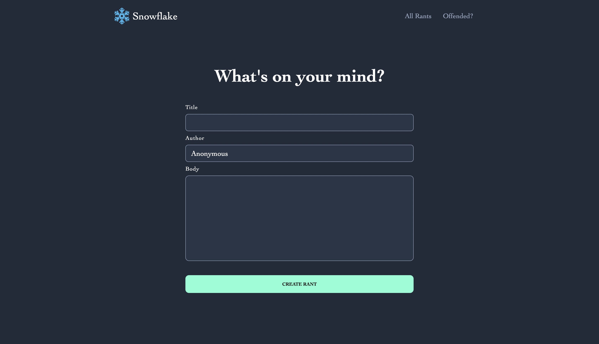

### ✨ [Blog App (Click to see live version)](https://snowflake-rant.herokuapp.com)

>> ###### *A Ruby on Rails application that allows a user to create a post.*
>> - Followed the Rails MVC pattern to create a full CRUD web interface that allows users to create, view, and delete a post.
>> - Enabled Rails order method to display the most recent post and Date object methods to show the date of creation.
>> - Implemented a model-based default value on the author of the post so the user has an option for anonymity.

